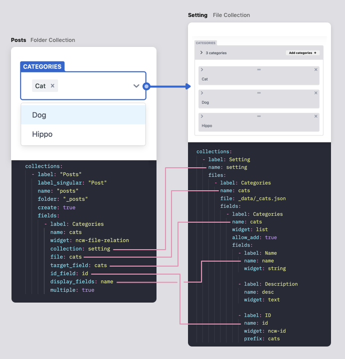

<h1 align="center">File Relation Widget for NetlifyCMS</h1>

<p align="center">A widget for <a href="https://www.netlifycms.org/" target="_blank">netlify-cms</a> to dropdown select from a file collection instead of a folder collection.</p>

---

<p align="center">⚠ Unstable: Under active development</p>

## Installation
```
npm i @ncwidgets/file-relation
```

## Important

Please check your `netlify-cms-app`/`netlify-cms` version:
`@ncwidgets/file-relation@0.5.0` is only compatible with `netlify-cms-app` version `2.9.7` and below.
Use `@ncwidgets/file-relation^0.5.2` for `netlify-cms-app^2.11.32`.


## Demo

In the demo below, the `categories` field is loaded from a file collection.

<a href="https://custom-widgets.netlify.com/#/collections/posts/entries/hej" target="_blank">Live demo</a>

### Register
```js
import cms from 'netlify-cms-app'
import { Widget as FileRelationWidget } from '@ncwidgets/file-relation'

cms.registerWidget(FileRelationWidget)

cms.init()
```

## Example use
How to Use



## How to use
### Example config

```yml
collections:
  - label: Posts
    label_singular: Post
    name: posts
    folder: _posts
    create: true
    fields:
      - label: Categories
        name: cats

        # Default widget name
        widget: ncw-file-relation

        # Collection name
        collection: setting

        # The name of the file in that collection
        file: categories

        # The field that is a list
        target_field: categories

        # The field that will be used to store data
        # Only applicable to list with multi fields
        id_field: id

        # The field that will be used to show as options
        # Only applicable to list with multi fields
        display_fields: name

        # Allow multiple selection
        multiple: true 
```

The above configuration will target the following file collection:
```yml
collections:
  - label: Setting
    name: setting  # <---- 'collection'
    files:
      - label: Categories
        name: categories  # <---- 'file'
        file: _data/_cats.json
        fields:
          - label: Categories
            name: categories # <---- 'target_field'
            widget: list
            allow_add: true
            fields:
              - label: Name
                name: name # <--- 'display_fields'
                widget: string

              - label: Description
                name: desc
                widget: text

              - label: ID
                name: id # <---- 'id_field'
                widget: ncw-id
                prefix: cats
```

Say you have the following data in your file collection:
```json
{
  "categories": [{
    "name": "Cat",
    "desc": "Cats are cool",
    "id": "cats-GQnCNUpF2"
  }, {
    "name": "Dog",
    "desc": "Dogs are alright",
    "id": "cats-S_Aev5Ts-B"
  }, {
    "name": "Hippo",
    "desc": "Hippo is love",
    "id": "cats-1wpAUDyA-W"
  }]
}
```

The data will be stored in the post as follow:
```json
{
  "title": "Hej världen!",
  "id": "post-HahELOG49",
  "categories": [{
    "value": "cats-GQnCNUpF2",
    "label": "Cat"
  }, {
    "value": "cats-S_Aev5Ts-B",
    "label": "Dog"
  }]
}
```

<p>Read more about configuration options on <a href='https://www.netlifycms.org/docs/configuration-options/'  target="_blank">netlifyCMS</a>.</p>


## Contribute

Found a bug or a missing feature? Please feel free to send over a PR, or open an issue with the `bug` or `enhancement` tag.
