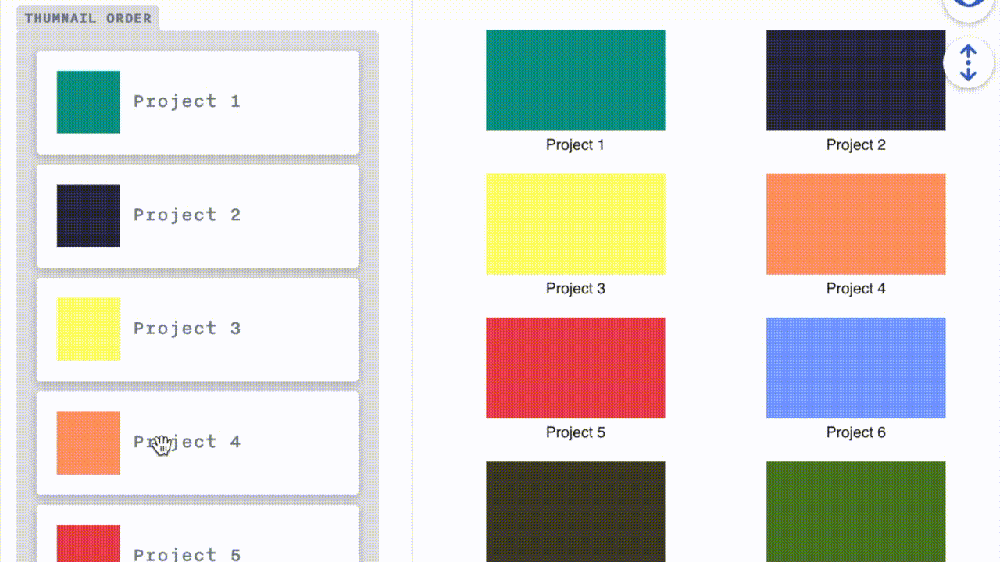

<h1 align="center">Reorder Widget for NetlifyCMS</h1>

<p align="center">A widget for <a href="https://www.netlifycms.org/" target="_blank">netlify-cms</a> to handle custom ordering of a referenced collection. Powered by <a href="https://github.com/atlassian/react-beautiful-dnd">react-beautiful-dnd</a></p>

---

<p align="center">⚠ Unstable: Under active development</p>

## Installation
```
npm i @ncwidgets/reorder
```

## Demo

<a href="https://custom-widgets.netlify.com/#/collections/pages/entries/home" target="_blank">Live demo</a>

## Example use
* Order items in a grid from another collection (using custom reorder-component).
  
* Setup a custom order for any collection.

## How to use
### Example config
Assuming that `posts` are a separate collection that contains fields `id` and `title`.

```yml
- label: Featured Posts
  name: featured
  widget: ncw-reorder
  collection: posts
  id_field: id
  display_template: '{{id}} | {{title}}'
```
#### Widget specific fields
* `collection` (**required**) is the name of the referenced collection.
* `id_field` (**required**) is a field in the referenced collection which has to be an unique identifier.
* `display_template` A string template with fields of the target entry. Use dot notation for nested fields & bracket for array: `{{address.zipCode}} | {{categories[0]}}`


<p>Read more about configuration options on <a href='https://www.netlifycms.org/docs/configuration-options/'  target="_blank">netlifyCMS</a>.</p>

### Register default reorder-component
```js
import cms from 'netlify-cms-app'
import { Widget as ReorderWidget } from '@ncwidgets/reorder'

cms.registerWidget(ReorderWidget)

cms.init()
```

### Register custom reorder-component

```js
import cms from 'netlify-cms-app'
import { createWidget } from '@ncwidgets/reorder'

const ListComponent = ({ item }) => (
  <>
    <strong>{item.title}</strong>
    <p style={{ margin: 0, color: '#798291', fontSize: '0.8rem' }}>{item.id}</p>
  </>
)

const CustomReorderPreview = ({ items }) => (
  <section>
    <hr />
    <p>Custom Widget Preview</p>
    {items.map((item, i) => <p key={i}>{item.title}</p>)}
  </section>
)

const customReorderWidget = createWidget({
  renderControl: ({ value }) => <ListComponent item={value} />,
  renderPreview: ({ value }) => <CustomReorderPreview items={value}/>,
})

cms.registerWidget({
  name: 'custom-reorder',
  ...customReorderWidget,
})

cms.init()
```

## Contribute

Found a bug or a missing feature? Please feel free to send over a PR, or open an issue with the `bug` or `enhancement` tag.
